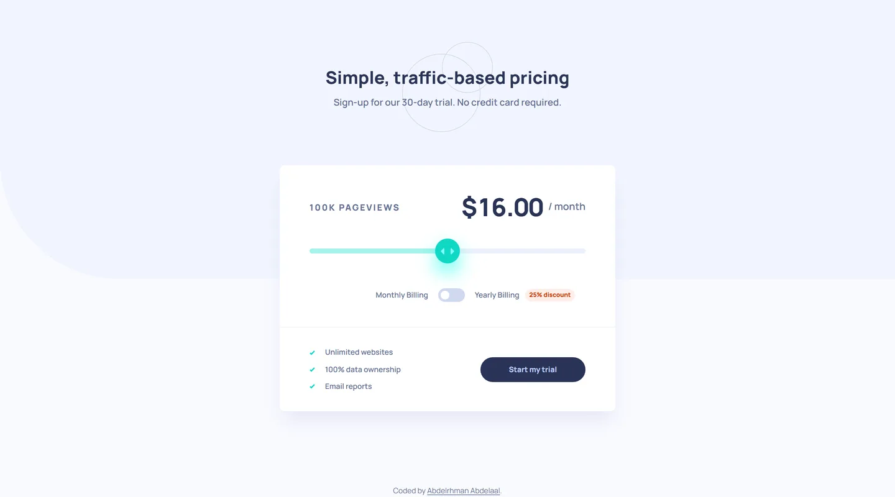

# Interactive pricing component

My solution to the [Interactive pricing component](https://www.frontendmentor.io/challenges/interactive-pricing-component-t0m8PIyY8) challenge on Frontend Mentor.

- Live: https://interactive-pricing-component.abdelrhman-ahmed8881.workers.dev
- Code: https://github.com/MrBlackvanta/interactive-pricing-component

## Built with

- Next.js
- React
- TypeScript
- Tailwind CSS

## Author

- [LinkedIn](https://www.linkedin.com/in/abdelrhman-vanta/)
- [UpWork](https://www.upwork.com/freelancers/mrblackvanta)
- [Frontend Mentor](https://www.frontendmentor.io/profile/MrBlackvanta)
